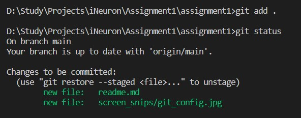

# Task 1 - 15 most used git commands.
## Global configuration settings, user name and user email.
Setting the username and email will make sure that our vscode knows where to push the changes, which repo we are referring to and which account on github we want all our work to be synced at.
```
git config --global user.name "PratyushMalik"
git config user.name
git config --global user.email "pratyush0410@gmail.com"
git config user.email

```


## Adding/Staging the changes
Once the repo is initialized, we need to stage these changes in order to further commit them. We'll add all the files in our working directory to the staging area. We can also add specific files to the staging area using file_name instead of ".". In order to see what our code did, we will check the status afterwards.
```
git add .
git add file_name
git status
```


## Committing changes
After the changes are staged temporarily (meaning, it can be unstaged), we can decide to permanently create a snapshot of this stage so that it can further pushed to out remote repo and the snapshot will be saved such that everything (when,where,what changed) is logged properly.
```
git commit -m "readme.md and few snips"
```


## Adding + Committing changes.
As we keep modifying our files, we can simply use this to add and commit simultaneously. This will only affect the modified files and will not add or commit new files.
```
git commit -a -m "add and commit together"
```


## Push changes to repo
Once committment is done, we will push it to remote repo so that we can see it in out github account. From our local branch, we will push it to our main branch. In case we are working in a different branch other than main branch, then we must merge branch instead of pushing changes.
```
git push origin main
```